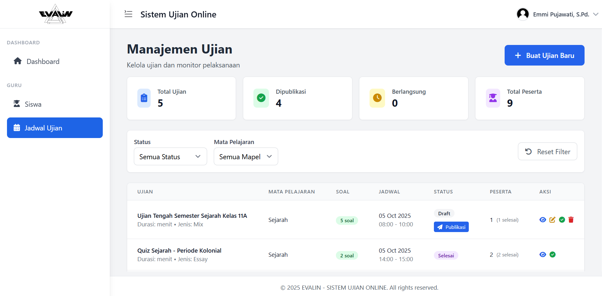

# EVALIN - Sistem Ujian Online

<div align="center">
  
  
  <br>
  
  <p><strong>Aplikasi Ujian dengan Koreksi Otomatis Berbasis LLM</strong></p>
</div>

## 📝 Tentang Evalin

**EVALIN** adalah platform sistem ujian online yang dirancang khusus untuk memudahkan proses evaluasi pembelajaran di era digital. Sistem ini menyediakan solusi lengkap untuk mengelola ujian online dengan dukungan **dua jenis soal**: **pilihan ganda** dan **esai** yang dilengkapi dengan **sistem koreksi esai otomatis berbasis LLM (Large Language Model)** yang transparan dan efisien.

### 🎯 Tujuan Proyek
- Digitalisasi proses ujian dan evaluasi pembelajaran dengan dukungan AI
- Meningkatkan efisiensi dalam pengelolaan ujian dan penilaian esai
- Menyediakan sistem penilaian yang akurat, transparan, dan konsisten berbasis LLM
- Memfasilitasi pembelajaran jarak jauh dengan tools evaluasi yang handal dan modern
- Mengotomatisasi proses koreksi esai untuk menghemat waktu guru

## 🖼️ Preview Aplikasi

<div align="center">
  
  <p><em>Dashboard Manajemen Ujian untuk Guru</em></p>
</div>

## ⚡ Fitur Utama

### 👨‍🏫 Untuk Guru
- **Manajemen Ujian**: Buat, edit, dan kelola ujian pilihan ganda & esai dengan mudah
- **Bank Soal**: Import dan kelola soal dalam format CSV (pilihan ganda dan esai)
- **Penjadwalan**: Atur jadwal ujian dengan fleksibel
- **Koreksi Otomatis LLAMA**: Sistem koreksi esai otomatis berbasis Meta's LLAMA yang transparan
- **Monitoring Real-time**: Pantau progress siswa secara langsung
- **Export Hasil**: Download hasil ujian dalam format PDF/Excel
- **Manajemen Kelas**: Kelola siswa dan kelas dengan efisien
- **Review AI Assessment**: Tinjau dan validasi hasil penilaian AI untuk esai

### 👨‍🎓 Untuk Siswa
- **Interface Ujian Modern**: Antarmuka yang clean untuk soal pilihan ganda dan esai
- **Auto-save**: Jawaban tersimpan otomatis untuk kedua jenis soal
- **Timer Management**: Pengelolaan waktu ujian yang akurat
- **Text Editor Esai**: Editor teks yang nyaman untuk menjawab soal esai
- **Hasil Instan**: Lihat hasil ujian secara real-time (pilihan ganda langsung, esai setelah AI assessment)
- **History Ujian**: Riwayat ujian dan nilai yang telah dikerjakan
- **Feedback Transparan**: Melihat detail penilaian AI untuk jawaban esai

### 🔧 Untuk Administrator
- **User Management**: Kelola akun guru dan siswa
- **System Monitoring**: Monitor kinerja sistem dan AI assessment
- **LLAMA Configuration**: Konfigurasi model LLAMA untuk koreksi esai
- **Backup Data**: Backup dan restore data sistem
- **Laporan Komprehensif**: Generate laporan sistem dan analisis AI performance
- **Quality Control**: Monitor akurasi dan konsistensi penilaian AI


## 🤖 Fitur AI-Powered Assessment

### Koreksi Esai Otomatis
- **LLAMA Integration**: Menggunakan Meta's LLAMA (Large Language Model Meta AI) untuk penilaian esai yang akurat
- **Rubrik Penilaian**: Sistem penilaian berdasarkan kriteria yang dapat disesuaikan
- **Transparansi**: Setiap penilaian AI disertai dengan penjelasan dan reasoning
- **Consistency**: Penilaian yang konsisten tanpa bias subjektif menggunakan LLAMA
- **Speed**: Koreksi instan untuk ratusan jawaban esai sekaligus dengan performa LLAMA

### Keunggulan AI Assessment
- **Objektif**: Penilaian berdasarkan kriteria yang telah ditetapkan
- **Scalable**: Dapat menangani volume ujian yang besar
- **Detailed Feedback**: Memberikan feedback konstruktif untuk siswa
- **Quality Assurance**: Sistem validasi untuk memastikan akurasi penilaian
- **Audit Trail**: Jejak digital untuk setiap keputusan penilaian AI

## 🛠️ Tech Stack

<div align="center">

### Backend


### AI & Machine Learning


### Frontend


### Tools & Libraries


</div>

## 🚀 Instalasi

### 1. Clone Repository
```bash
git clone https://github.com/Atadewa/Evalin-Project.git
cd Evalin-Project
```

### 2. Install Dependencies
```bash
# Install PHP dependencies
composer install

# Install Node.js dependencies
npm install
```

### 3. Environment Setup
```bash
# Copy environment file
cp .env.example .env

# Generate application key
php artisan key:generate
```

### 4. Database Configuration
Edit file `.env` dan sesuaikan konfigurasi database:
```env
DB_CONNECTION=mysql
DB_HOST=127.0.0.1
DB_PORT=3306
DB_DATABASE=evalin_db
DB_USERNAME=your_username
DB_PASSWORD=your_password
```

### 5. Database Migration & Seeding
```bash
# Run migrations
php artisan migrate

# Run seeders (optional)
php artisan db:seed
```

### 6. Build Assets
```bash
# Development
npm run dev

# Production
npm run build
```

### 7. Run Application
```bash
# Development server
php artisan serve

# Or using the dev script (recommended)
composer run dev
```

Aplikasi akan berjalan di `http://localhost:8000`


## 📊 Database Schema

### Models Utama:
- **User**: Manajemen pengguna (Admin, Guru, Siswa)
- **Ujian**: Data ujian dan konfigurasi (pilihan ganda & esai)
- **Soal**: Bank soal dengan opsi jawaban dan rubrik penilaian esai
- **JawabanSiswa**: Jawaban siswa dan penilaian (manual & AI-generated)
- **Kelas**: Manajemen kelas dan mata pelajaran
- **UjianSiswa**: Relasi ujian dengan siswa